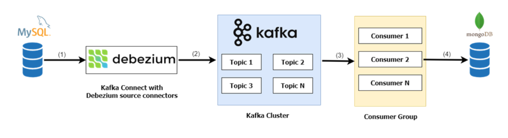

# Uni_ThucTapTotNghiep-2025

> Applying **Change Data Capture (CDC)** to convert / synchronize data in real time between database management systems: **MySQL → MongoDB**.

Graduation internship report *"Applying Change Data Capture (CDC) to convert data between database management systems"* – University of Transport and Communications (Ho Chi Minh City Campus), internship at FPT Telecom, 2025.

📄 See the full [report](https://github.com/K1ethoang/My-Achievements/blob/main/Reports/4th-year/TTTN.pdf)



---

## How it works

1. **Capture changes in MySQL** – **Debezium** (running on Kafka Connect) connects to MySQL via the `binlog` (`binlog-format=ROW`) and records every row-level `INSERT / UPDATE / DELETE`.
2. **Publish change events to Kafka** – each MySQL table maps to a topic `mysql.<database>.<table>`. The Kafka cluster has **2 brokers** (`9092`, `9093`), each topic with 2 partitions.
3. **Consume & write to MongoDB** – `consumer-worker.py` (a Kafka consumer that runs outside Django but reuses its `settings`) subscribes to the pattern `^mysql\.employees\..*`, decodes the Debezium payload, and applies the change to MongoDB:
   - `op = c` / `r` → `insert_one`
   - `op = u` → `update_one` (`$set`, match on the `before` document)
   - `op = d` → `delete_one` (match on `before`)
   - Date fields (`from_date`, `to_date`) are converted from epoch-day integers to `datetime`.
4. **Sample Django app** – provides Django Admin + ORM models mapped to the tables of the `employees` sample database (`managed = False`).

## Dataset

Uses MySQL's **Employees Sample Database**: <https://github.com/datacharmer/test_db> (included in the `test_db/` folder).
Tables: `employees`, `departments`, `dept_emp`, `dept_manager`, `titles`, `salaries`.

## Requirements

- Python **3.13**
- Docker & Docker Compose
- A MySQL client (to load the sample data)

## Setup & run

### 1. Prepare

```bash
# create the .env file from the template
cp dev.env .env
```

Fill in `.env`:

```env
DEBUG=True

DB_MYSQL_DATABASE=employees
DB_MYSQL_USER=root
DB_MYSQL_PASSWORD=your_password
DB_MYSQL_HOST=127.0.0.1
DB_MYSQL_PORT=3306

DB_MONGODB_DATABASE=cdc
DB_MONGODB_HOST=127.0.0.1
DB_MONGODB_USER=
DB_MONGODB_PASS=
DB_MONGODB_PORT=27017

CONSUMER_GROUP_ID=cdc-group
KAFKA_TOTAL_THREAD=3
KAFKA_TOTAL_WORKER=1     # = number of topic partitions
```

### 2. Start the infrastructure (Docker)

```bash
docker compose --env-file .env -f ./docker/docker-compose.yml up -d --build
```

Services: `mysql` (binlog ROW enabled), `mongodb`, `zookeeper`, `kafka-1`, `kafka-2`, `kafka-connect` (Debezium 2.7.3), `kafka-ui`.

### 3. Load the sample data into MySQL

```bash
# from the test_db folder (or use test_db/load-data.sh inside the mysql container)
mysql -h 127.0.0.1 -u root -p employees < test_db/employees.sql
```

### 4. Register the Debezium connector

```bash
docker exec -it kafka-connect bash
# check that Kafka Connect is ready
curl -s http://localhost:8083/
# register the MySQL connector
sh /register-connector.sh
```

### 5. Run the Django app + consumer

```bash
python -m venv .venv && source .venv/bin/activate
pip install -r requirements.txt

python manage.py makemigrations
python manage.py migrate
python manage.py createsuperuser --username admin

python manage.py runserver                          # terminal 1 – Django admin
python applications/employee/consumer-worker.py      # terminal 2 – CDC consumer (MySQL -> MongoDB)
```

### 6. Access

| URL | Description |
|---|---|
| <http://127.0.0.1:8000/admin> | Django Admin – CRUD on the MySQL tables |
| <http://127.0.0.1:5000> | Kafka UI – inspect brokers / topics / consumers / messages |

Test: add / edit / delete a record in Django Admin (or directly in MySQL) → watch the message in Kafka UI → the corresponding data is updated in MongoDB (`cdc` database, collection named after the table).

## Directory layout

```
Uni_ThucTapTotNghiep-2025/
├── manage.py
├── requirements.txt
├── dev.env                         # environment template (rename -> .env)
├── cdc_project/                    # Django config (settings: MySQL + Mongo + Kafka)
├── applications/employee/
│   ├── models.py                   # ORM mapping of the employees tables (managed = False)
│   ├── admin.py                    # Django Admin
│   ├── mongodb.py                  # MongoDb.replicate_data() – applies a CDC event
│   └── consumer-worker.py          # multi-process / multi-thread Kafka consumer
├── docker/
│   ├── docker-compose.yml          # MySQL, MongoDB, Zookeeper, 2 Kafka brokers, Kafka Connect, Kafka UI
│   ├── register-mysql.json         # Debezium MySQL connector config
│   └── register-connector.sh
└── test_db/                        # Employees Sample Database (datacharmer/test_db)
```

## Limitations & future work

- Topics have only 2 partitions and a single consumer group → limited throughput under heavy load.
- No retry / error handling when a MongoDB write fails.
- Possible extensions: more partitions, more consumers, integrating Apache Flink / Spark Streaming.
